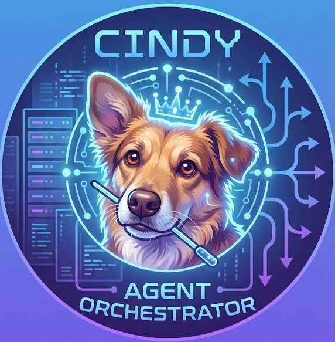

# {{PROJECT_NAME}}

## {{WORKSTREAM_NAME}}

Resumo executivo do projeto em pt-BR, com foco no objetivo atual, no valor esperado e no limite de escopo da sprint/fase em vigor.

---

## 1. Visao geral

O `{{PROJECT_NAME}}` e o repositorio raiz para:

- {{PRIMARY_SCOPE_1}}
- {{PRIMARY_SCOPE_2}}
- {{PRIMARY_SCOPE_3}}

Objetivos principais:

- {{MAIN_OBJECTIVE_1}}
- {{MAIN_OBJECTIVE_2}}
- {{MAIN_OBJECTIVE_3}}

## 2. Estado atual

- Sprint ativa: `{{ACTIVE_SPRINT}}`
- Estado da sprint: `{{SPRINT_STATUS}}`
- Fase atual: `{{CURRENT_PHASE}}`
- Escopo aprovado: `{{APPROVED_SCOPE}}`

## 3. Controle de sprints

| Sprint | Periodo | Estado | Tracking | Observacoes |
| --- | --- | --- | --- | --- |
| {{ACTIVE_SPRINT}} | {{SPRINT_PERIOD}} | {{SPRINT_STATUS}} | `Dev_Tracking_{{ACTIVE_SPRINT}}.md` | {{SPRINT_NOTES}} |

## 4. Pendencias Atuais

- `{{PENDING_ITEM_1}}`
- `{{PENDING_ITEM_2}}`
- `{{PENDING_ITEM_3}}`

## 5. Artefatos Canonicos

- `README.md`
- `Dev_Tracking.md`
- `Dev_Tracking_{{ACTIVE_SPRINT}}.md`
- `docs/SETUP.md`
- `docs/ARCHITECTURE.md`
- `docs/DEVELOPMENT.md`
- `docs/OPERATIONS.md`
- `tests/bugs_log.md`

## Cindy — Orquestradora (Context Router)

A Cindy é o agente principal do projeto. Em cada run, ela identifica o orchestrator ativo (Cline/Codex/Antigravity), a superfície de execução (VSCode/CLI) e o workspace root; em seguida, descobre e seleciona as skills/workflows disponíveis no contexto atual, respeitando os gates DOC2.5 (plano aprovado antes de execução; commit/push apenas sob ordem explícita do PO).

  

